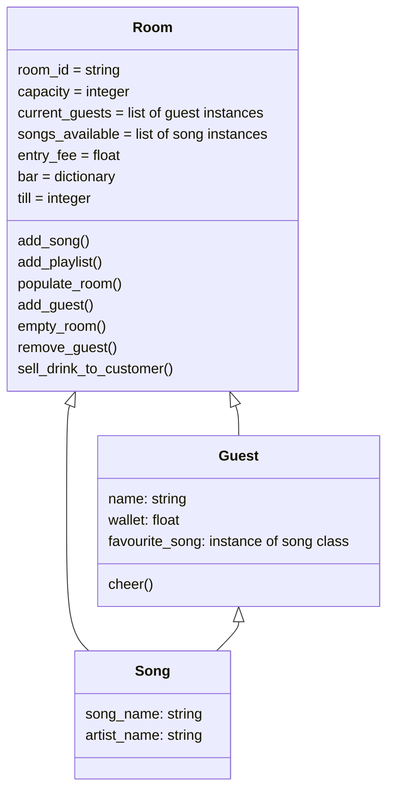

```mermaid
classDiagram

class Room{
    room_id = string
    capacity = integer
    current_guests = list of guest instances
    songs_available = list of song instances
    entry_fee = float
    bar = dictionary
    till = integer
    add_song()
    add_playlist()
    populate_room()
    add_guest()
    empty_room()
    remove_guest()
    sell_drink_to_customer()
    }


class Guest{
    name: string
    wallet: float
    favourite_song: instance of song class
    cheer()
}


class Song{
    song_name: string
    artist_name: string
}

Room <|-- Guest
Room <|-- Song
Guest <|-- Song

```